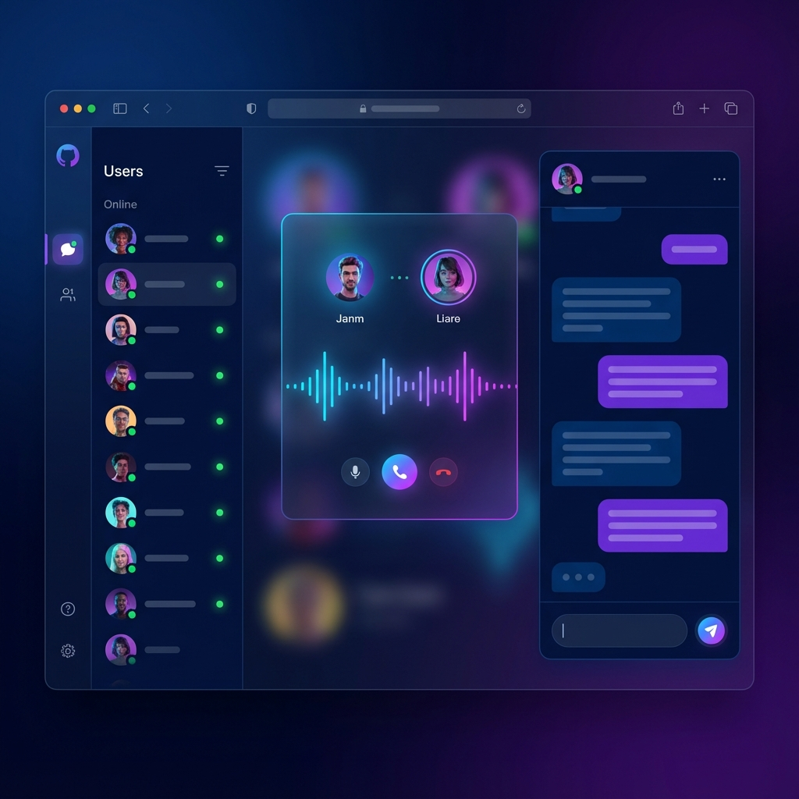

# 語音聊天室系統 (Voice Chat App)


_（註：此為 AI 生成之示意圖，實際介面以程式為準）_

這是一個基於 WebRTC 的即時語音通話系統，支援多裝置連線、PWA 安裝、以及即時通知功能。

## ✨ 功能特色

- **🎤 純語音通話**：專注於高品質語音，節省頻寬，介面簡潔。
- **💬 文字聊天**：支援即時文字訊息傳送，通話中也能打字交流。
- **🔔 即時通知**：支援來電通知、訊息通知，即使在背景也能收到提示。
- **📱 PWA 支援**：可安裝在手機或電腦桌面上，像原生 App 一樣使用。
- **🔒 安全連線**：透過 Cloudflare Tunnel 提供 HTTPS 加密連線。
- **👥 多人上線**：支援多人同時在線，點擊即可撥打。

---

## 🚀 超簡單安裝教學 (只要做一次就好)

別擔心，這個過程很安全，不會弄壞電腦！請跟著步驟慢慢做：

### 第一步：準備工具

1. 請先下載並安裝 **Node.js** (這是讓程式運作的引擎)。
   - [點我下載 Node.js](https://nodejs.org/)
   - 下載左邊的 **LTS 版本**。
   - 安裝時**一直按「Next (下一步)」**到底即可，設定都不用改。

### 第二步：下載專案程式碼

您可以選擇以下其中一種方式：

1. **使用 Git (推薦)**：
   ```bash
   git clone https://github.com/Mr-Guo-2025/voice-chat-app.git
   cd voice-chat-app
   ```
2. **下載 ZIP 檔**：
   - 點擊 GitHub 頁面上的 **Code** 按鈕 -> **Download ZIP**。
   - 解壓縮到桌面，並進入資料夾。

### 第三步：安裝相依套件 (關鍵步驟！)

1. 在資料夾空白處按 `Shift + 右鍵`，選擇「在此處開啟 PowerShell 視窗」或「在終端機中開啟」。
2. 輸入以下指令並按 Enter：
   ```bash
   npm install
   ```
3. 等待安裝完成。

### 第四步：設定金鑰與密碼 (重要！)

因為安全考量，預設的密碼和金鑰都是範例，請務必修改：

1. **產生新的推播金鑰**：

   - **產生金鑰**：
     在黑底視窗 (PowerShell) 輸入指令：

     ```bash
     node generate_keys.js
     ```

     按 Enter 後，你會看到類似這樣的畫面：

     ```
     Public Key:  BKv... (一長串亂碼)
     Private Key: K9r... (另一串亂碼)
     ```

   - **貼上金鑰**：
     1. 用記事本或程式編輯器打開 `server.js` 檔案。
     2. 往下捲動找到大約第 250 行。
     3. 你會看到：
        ```javascript
        const publicVapidKey = "YOUR_PUBLIC_VAPID_KEY_HERE";
        const privateVapidKey = "YOUR_PRIVATE_VAPID_KEY_HERE";
        ```
     4. 把剛剛視窗裡的 `Public Key` 複製，貼到第一行的引號 `""` 裡面。
     5. 把 `Private Key` 複製，貼到第二行的引號 `""` 裡面。
     6. 存檔並關閉。

2. **修改登入密碼**：
   - 打開 `server.js`，找到第 60 行左右的 `USERS` 設定。
   - 將 `password123` 修改為您想設定的密碼。

### 第四步：安裝連線工具

1. 再次打開那個藍底/黑底視窗 (PowerShell)。
2. 複製這行指令：
   ```powershell
   winget install --id Cloudflare.cloudflared
   ```
3. **複製這個網址**，這就是你們通話的「房間號碼」。

### 2. 登入系統

開啟瀏覽器 (Chrome/Edge/Safari)，輸入剛剛的網址。
預設帳號密碼：

- **管理員**: `admin` / `password123`
- **朋友**: `friend` / `password123`
- **訪客**: `guest` / `password123`

### 3. 安裝 App (手機強烈建議！)

為了讓通知功能正常，手機請務必安裝：

1. 用手機瀏覽器開啟網址。
2. 點擊登入畫面上的 **「📲 安裝 App」** 按鈕。
3. 如果沒出現，從瀏覽器選單找「加入主畫面」或「安裝應用程式」。

### 4. 撥打電話

1. 登入後，點擊右上角的 **「🔔」鈴鐺圖示** 確保它是綠色的。
2. 在名單上點擊朋友的名字。
3. 第一次會問「允許麥克風權限嗎？」，請一定要點 **「允許」**。

---

## ❓ 常見問題排解

### Q: 手機通話沒有聲音？

1. **檢查權限**：點擊網址列左邊的「鎖頭」🔒，確認「麥克風」權限已允許。
2. **音量顯示**：手機為了省電可能會暫停音量條動畫，點擊螢幕任意處即可恢復。
3. **重新整理**：如果權限剛開啟，請務必**重新整理網頁**。

### Q: 收不到來電通知？

1. 確認右上角鈴鐺是 **綠色** 的。
2. 手機請確認沒有開啟「勿擾模式」。
3. 嘗試重新安裝 PWA App。

### Q: 網址無法連線？

1. Cloudflare Tunnel 的免費網址每次重啟都會改變，請確認使用的是**最新**的網址。
2. 檢查電腦端的 `start_cloudflare.bat` 視窗是否還在執行中。
